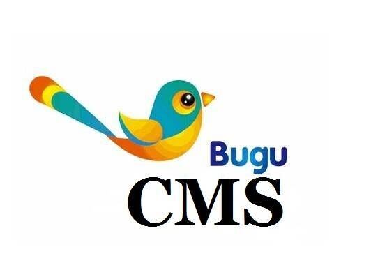
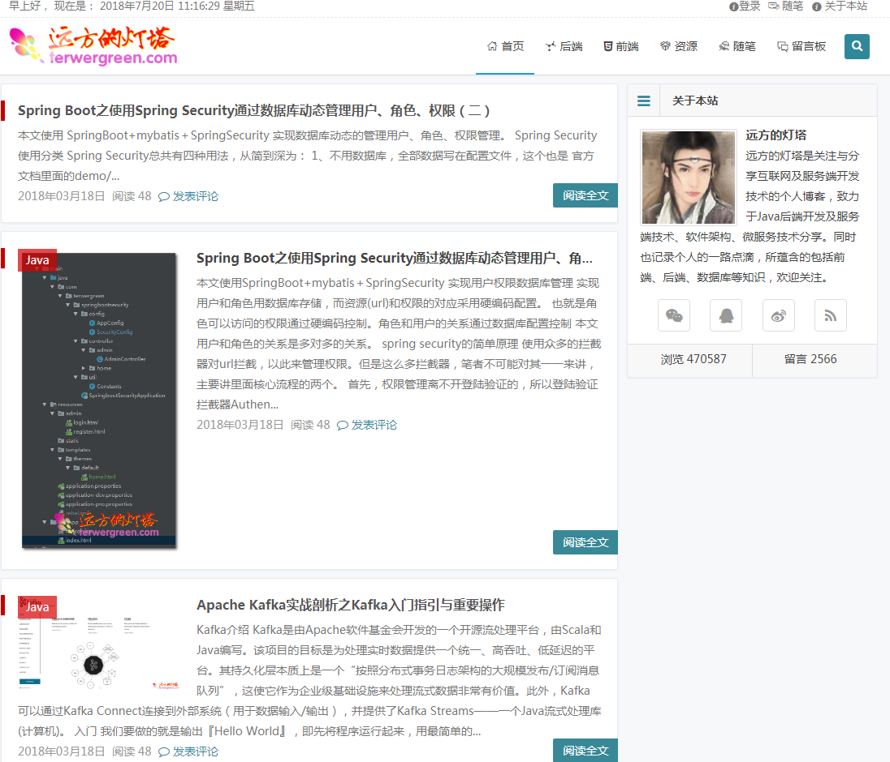
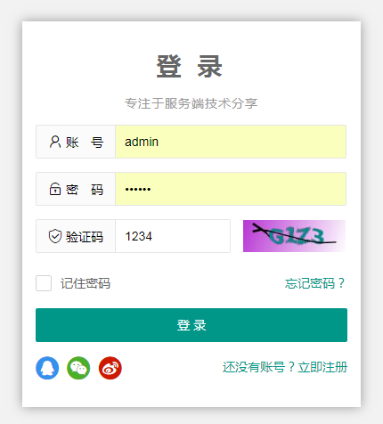
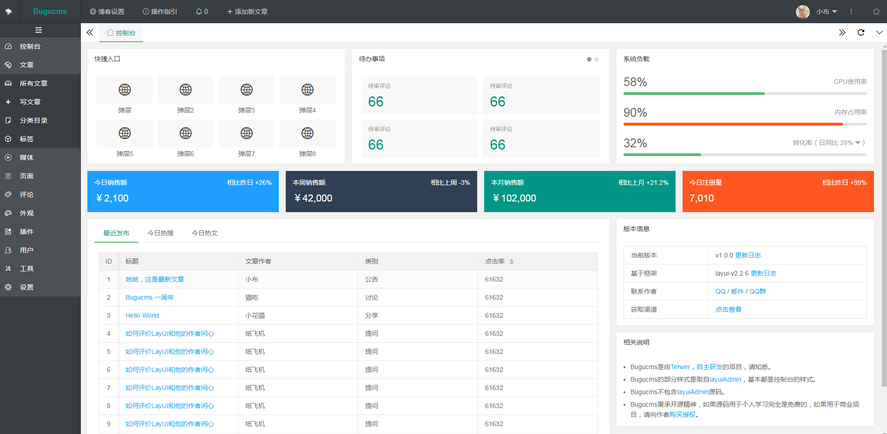

# bugucms
轻量级、插件化的内容管理系统



释义：BuguCMS，全称 Bugu Content Manage System，中文即布谷内容管理系统，灵感取自布谷鸟，鸣声响亮，二声一度，希望用户在使用时像耳边时刻响起布谷鸟叫声一样愉悦。

# 亮点
## 插件支持，支持自定义插件和扩展
## 多模板引擎支持，支持主流模板引擎Thymeleaf、Freemarker、Velocity
## 多数据库支持，主持主流数据库Oracle、SQL Server、MySQL

# 演示

http://www.terwergreen.com

# 截图







# 相关技术
Centos 7.4      
JDK1.8.162   
Spring Boot 2.0.0   
LogBack      
Thymeleaf模板引擎         
Maven 3.5.3 (使用阿里云Maven仓库)          
Tomcat 8.5.28   
MySQL 5.7.19   
Oracle 11g    
MyBatis 3.4.6   
JSON    
kaptcha图片验证码组件  
HTML5      
jQuery 1.10.1     
bootstrap 3.3.7   
[LAU](https://github.com/carolkey/lying-admin/)（基于layui的后台管理模板）     

# 启动
## 注意
（1）ojdbc6.jar需要手动安装，在项目的lib目录下，需要用命令```mvn install:install-file -DgroupId=com.oracle -DartifactId=ojdbc6 -Dversion=11.2.0.4 -Dpackaging=jar -Dfile=ojdbc6.jar```安装        
（2）Spring Boot 默认将 /webjars/** 映射到 classpath:/META-INF/resources/webjars/ ，根据访问资源的规则，在JSP页面中引入jquery.js的方法为：
```
<script type="text/javascript" src="${pageContext.request.contextPath}/webjars/jquery/1.10.1/jquery.js"></script>
```
（3）错误页面网页与API调用分开，用``isAPI``字段标识，``String isAPI = request.getParameter("isAPI");``，网页访问不传，API访问传``Y``，API调用系统异常返回JSON，网页访问系统异常输出HTML页面。            

## 本地启动   
（1）打开``pom.xml``里面```spring-boot-starter-tomcat```的```<scope>provided</scope>```   
（2）运行```BugucmsApplication.java```里面的```main```方法  

## Tomcat启动
（1）注释掉``pom.xml``里面```spring-boot-starter-tomcat```的```<scope>provided</scope>``` ，或者直接复制```pom-prd-tomcat.xml```到```pom.xml```   
（2）使用IntelliJ IDEA        
Build --> Build Artifacts --> 选择要打包编译的war --> 在项目target文件夹下出现新的war包   
或者使用eclipse    
Run as -->Maven Build -->  在弹出的框里面输入命令 ``package``，点击run，等待任务完成出现 ``BUILD SUCCES``，``ROOT.war``就会被打包好在``target``目录下     
（3）将war包放到tomcat的webapps目录下  

## 发布流程
（1）打包之前copy``pom-pro-tomcat.xml``到``pom.xml``      
（2）打包之前修改``application.properties``改为``spring.profiles.active=dev`` 
（3）部署之前初始化ddl表结构（如果需要），例如MySQL目录为db/MySQL      
（4）部署之前``20180720-pro.sql``初始化数据（如果需要），例如MySQL目录为db/MySQL        

## 参考
[玩转spring boot——负载均衡与session共享](http://www.cnblogs.com/GoodHelper/p/6263240.html)  
[ Spring Boot项目利用Redis实现session管理](https://blog.csdn.net/skyebefreeman/article/details/73076785)     
[spring-boot+spring-session集成](https://yq.aliyun.com/articles/182676)      
[使用Spring Session实现Spring Boot水平扩展](https://zhuanlan.zhihu.com/p/31673247)     
[SpringBoot集成Shiro并用MongoDB做Session存储](http://www.tianshangkun.com/2017/11/10/SpringBoot%E9%9B%86%E6%88%90Shiro%E5%B9%B6%E7%94%A8MongoDB%E5%81%9ASession%E5%AD%98%E5%82%A8/)       
 